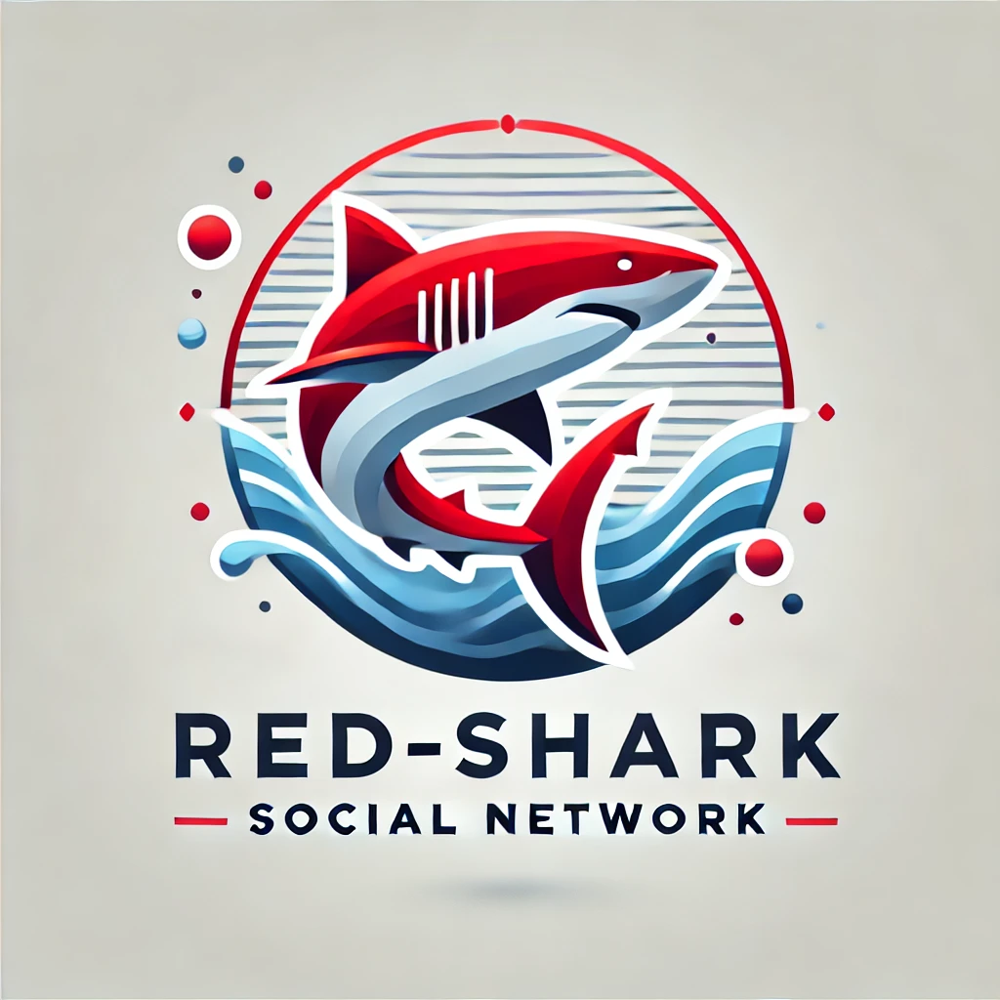

## Overview

  

Welcome to **Red-Shark**, the open-source social media platform that dares to be different! Here, user safety and privacy aren’t just buzzwords—they’re our core mission. Tired of social networks treating you like a product? Red-Shark is your safe harbor. At our social network, your privacy isn't a feature—it's a promisse. Say goodbye to hidden agendas and take control of your digital experience right now. Plus, it’s completely free and driven by community creativity. Think of it as the social media mashup of your dreams, where you decide what happens next.

Jumping into Red-Shark isn’t just about writing code—it’s about joining a movement. Here’s why you should roll up your sleeves and dive in:

1. **Level Up Your Skills:** Work on cutting-edge tech, solve meaningful challenges, and grow faster than you thought possible.
2. **Collaborate Globally:** Connect with passionate developers from all walks of life, creating something truly groundbreaking together.
3. **Build Your Portfolio:** Red-Shark isn’t just a project; it’s a chance to show off your work in a real-world, community-driven environment.
4. **Steer the Ship:** Our democratic voting system means your ideas can shape the platform’s future.

We’re not just coding a platform; we’re building a legacy. Be part of it.

## Technologies Used

### Backend Technologies

Here’s the secret sauce behind Red-Shark’s backend. We’ve stacked the deck with tech that’s powerful, reliable, and just plain cool:

- **[C#](https://learn.microsoft.com/en-us/dotnet/csharp/):** Modern, elegant, and built for performance—what’s not to love?
- **[.NET 8](https://learn.microsoft.com/en-us/dotnet/core/):** Cross-platform awesomeness to keep things smooth and scalable.
- **[SQL Server](https://www.microsoft.com/en-us/sql-server/sql-server-downloads):** Microsoft’s powerhouse database that never lets you down, even when your data grows like crazy. Fast, secure, and ready for anything!
- **[MongoDB](https://www.mongodb.com/docs/):** NoSQL wizardry for handling flexible and dynamic data.
- **[Dapper](https://github.com/DapperLib/Dapper):** Lightweight ORM magic that makes your database fly.
- **[AutoMapper](https://automapper.org/):** Turning complex object mapping into a breeze so you can focus on the fun stuff.
- **[Redis](https://redis.io/docs/):** Because no one likes waiting—supercharge your app with in-memory caching.
- **[RabbitMQ](https://www.rabbitmq.com/documentation.html):** Smooth and reliable messaging for when your services need to talk.
- **[BCrypt](https://github.com/BcryptNet/bcrypt.net):** Keeping your passwords secure and hackers out.
- **[Docker](https://docs.docker.com/):** Because "it works on my machine" isn’t good enough anymore.
- **[XUnit](https://xunit.net/):** Making sure your code doesn’t break (because no one likes surprises).
- **[JWT (JSON Web Token)](https://jwt.io/introduction):** Authentication made simple and secure.
- **[SignalR](https://learn.microsoft.com/en-us/aspnet/core/signalr/):** Real-time communication without the headache.
- **[Memcached](https://memcached.org/):** Fast, efficient, and always ready to speed things up.
- **[Azure Blobs](https://learn.microsoft.com/en-us/azure/storage/blobs/):** Store all the data—files, images, and more—in the cloud.
- **[Kafka](https://kafka.apache.org/documentation/):** Real-time streaming because your data deserves to move as fast as you do.
- **[ElasticSearch](https://www.elastic.co/guide/en/elasticsearch/reference/current/index.html):** Search that doesn’t make you wait.
- **[Keycloak](https://www.keycloak.org/documentation):** Authentication and access control that you can trust.
- **[gRPC](https://grpc.io/docs/):** High-speed protocol for smooth system communication.

### Frontend Technologies

Red-Shark’s frontend is built for a buttery-smooth user experience:

- **[Next.js](https://nextjs.org/docs):** Fast, modern, and SEO-friendly---the perfect frontend framework.
- **[Selenium](https://www.selenium.dev/documentation/):** Testing the UI so users never have to deal with glitches.

## Voting System

We’re big believers in community-driven innovation. That’s why Red-Shark uses a GitHub voting system for decision-making. Here’s how it works:

1. Got a brilliant idea? Submit it as a proposal on GitHub.
2. The community dives in—discussing, debating, and refining the proposal.
3. GitHub likes become votes. The idea with the most likes wins.

It’s democracy, developer-style. No committees, no red tape—just the best ideas rising to the top.

## Contribution Guidelines

To keep Red-Shark awesome, we ask all contributors to follow these guidelines:

1. **Keep It Clean:** Write clear, maintainable code that everyone can understand.
2. **Document Everything:** Every pull request should explain what it does and why it matters.
3. **Play Nice:** Offer constructive feedback and respect your fellow devs.
4. **Test Before You Submit:** Nobody likes broken builds—run your tests first.
5. **Follow the Code of Conduct:** We’re building a positive, inclusive community. Let’s keep it that way.

## License

Red-Shark’s license is designed to keep the project open and free while protecting against misuse. Here’s the gist:

- **Stay Community-Driven:** This is a collaborative effort, and we’re keeping it that way.
- **No Forking for Profit:** Want to make a commercial version? You’ll need approval first.
- **Give Credit Where It’s Due:** Acknowledge contributors and respect the license terms.

The full license details are coming soon, but trust us—they’re all about fairness and transparency.

## 💖 Support This Project
Help us make Red-Shark the social platform we all deserve! Your support helps us grow and continue building a safer, more open digital world.

  

  

